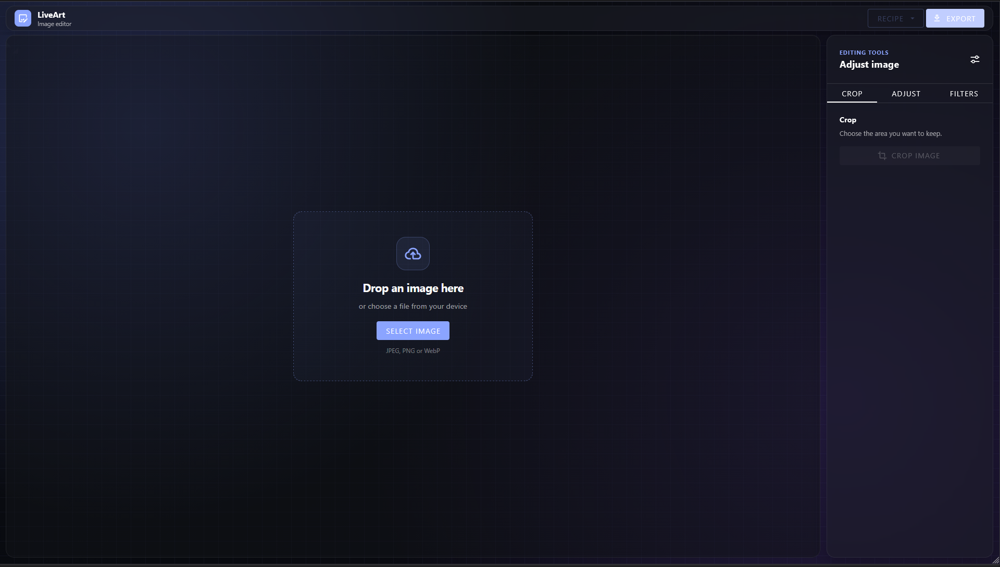
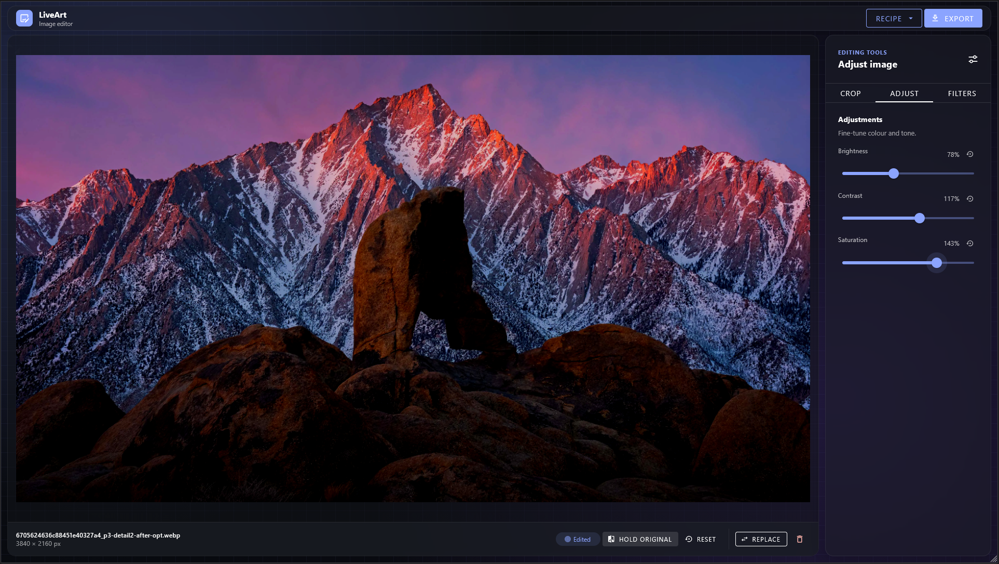
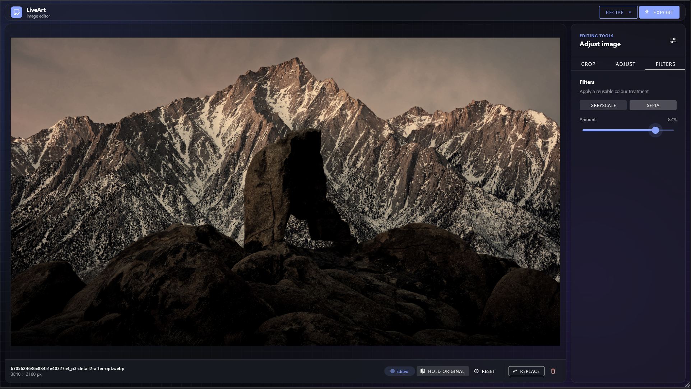
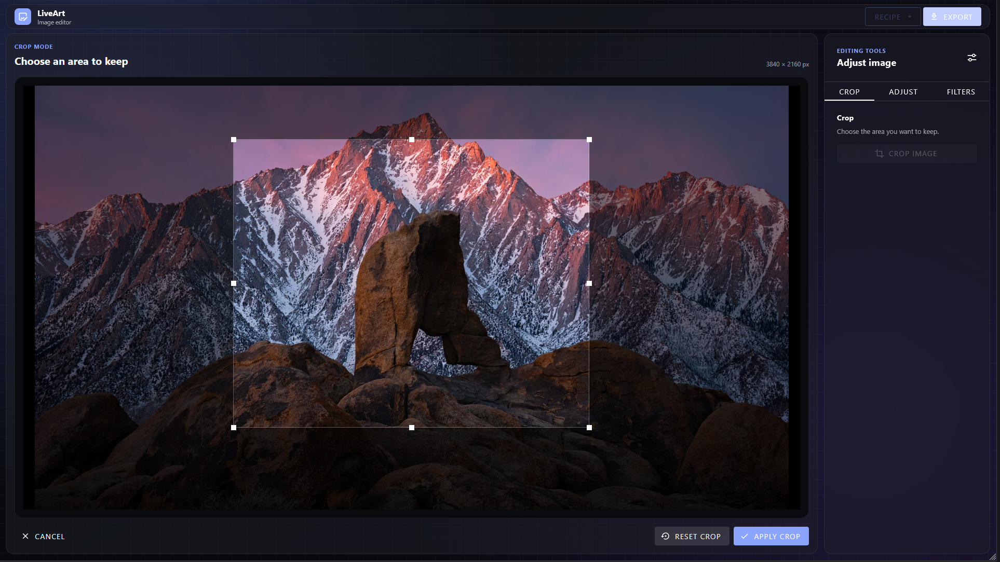

# LiveArt

LiveArt is a responsive, browser-based image editor built with Vue 3, Vuetify,
Pinia, and TypeScript. The original file remains immutable: preview and export
are always derived from the source and a compact edit document.

## Screenshots









## Features

- Upload or drop JPEG, PNG, and WebP images with MIME, size, decode, dimension,
  and pixel-count validation.
- Crop through an isolated Apply/Cancel draft workflow in source pixels.
- Live brightness, contrast, and saturation controls from `0%` to `200%`.
- Hold Original to compare without losing edits; reset one control or all edits.
- Full-resolution, alpha-preserving PNG export via `canvas.toBlob()`.
- Responsive, keyboard-accessible UI with explicit loading/error/disabled states.
- Bonus: adjustable greyscale and sepia filters.
- Bonus: versioned JSON recipe export and validated import/replay.

## Run locally

Requires Node.js `>=22.12.0` (`22.21.1` is recorded in `.nvmrc`).

```bash
npm i
npm run dev
```

No backend, environment variables, or external services are required.

## Architecture

- `src/components` owns presentation and interactions, never pixel processing.
- `src/stores/editor.ts` owns source, committed edits, transient state, and
  derived flags; runtime DOM/Canvas/cropper instances stay outside Pinia.
- `src/services` owns decoding, Canvas rendering, scheduling, export, and recipe
  serialization;
- `src/utils` contains independently testable calculations.

## Non-destructive model

`EditDocument` contains schema version 1, an optional crop, one canonical
adjustment object, and an optional filter. Slider events update canonical values
instead of appending event history. Crop stays local until Apply commits a
validated rectangle. Runtime resources never enter the JSON recipe.

Preview and export share one fixed pipeline:

```text
source → crop → brightness → contrast → saturation → optional filter → output
```

Preview rendering is viewport-limited and scheduled once per animation frame;
export uses the full crop resolution. A revision token prevents stale async
renders from replacing newer previews.

## Recipe example

<!-- prettier-ignore -->
```json
{
  "schemaVersion": 1,
  "source": { "name": "poster.jpg", "mimeType": "image/jpeg", "width": 4032, "height": 3024 },
  "operations": {
    "crop": { "type": "crop", "unit": "source-pixel", "x": 312, "y": 180, "width": 3200, "height": 2400 },
    "adjustments": { "type": "adjustments", "brightness": 1.08, "contrast": 1.12, "saturation": 0.9 },
    "filter": { "type": "filter", "name": "greyscale", "amount": 0.35 }
  }
}
```

Import is atomic and validates the schema, ranges, MIME type, and source
dimensions before replacing edits.

## Implementation notes

### Key decisions

- The original `File` is immutable. Pinia stores only a versioned edit document;
  preview, recipe replay, and export always derive from the same source.
- Crop uses a local draft and commits source-pixel coordinates only on Apply, so
  Cancel has no side effects and recipes are independent of viewport size.
- Adjustments are canonical values, not an event log. This keeps slider input,
  rendering, and JSON compact and deterministic.
- Canvas 2D keeps preview/export consistent; a print-grade evolution would need
  workers, WebGL/WebGPU, ICC profiles, high bit depth, CMYK, and spot colours.
- PNG is the only export format to preserve alpha predictably.
- Cropper runtime state is component-local; Pinia stores only committed geometry.

### Bonus

- Both optional bonuses were implemented: adjustable greyscale/sepia filters and
  versioned JSON export; recipe import was added to demonstrate replayability.

### Limitations

- There is no undo/redo, persistence, or cryptographic source fingerprint.
- Processing uses the main browser thread and is limited to `16,384px` per side
  and 40 megapixels to avoid unsafe Canvas allocations.
- Targets current Chrome, Edge, Firefox, and Safari; practical minimum viewport
  is `360 × 640`.
